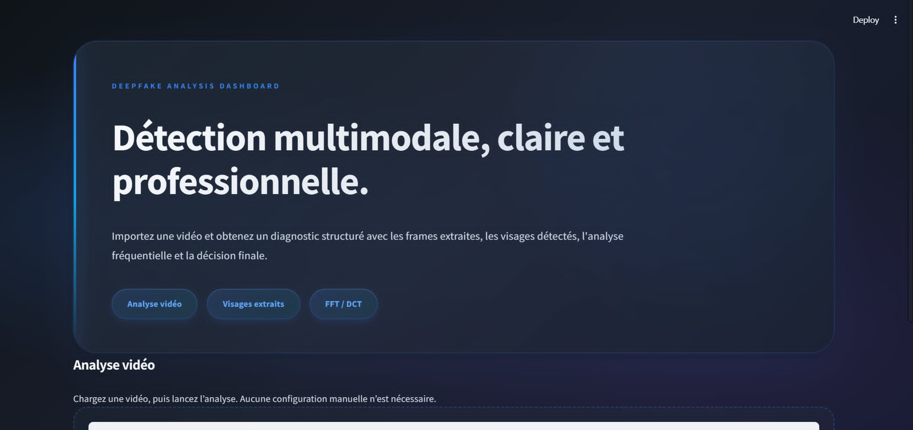
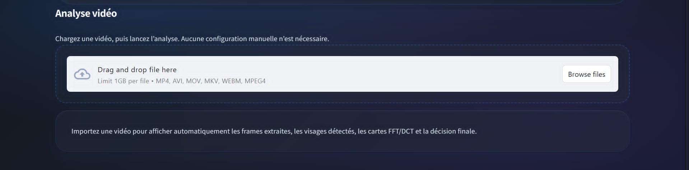
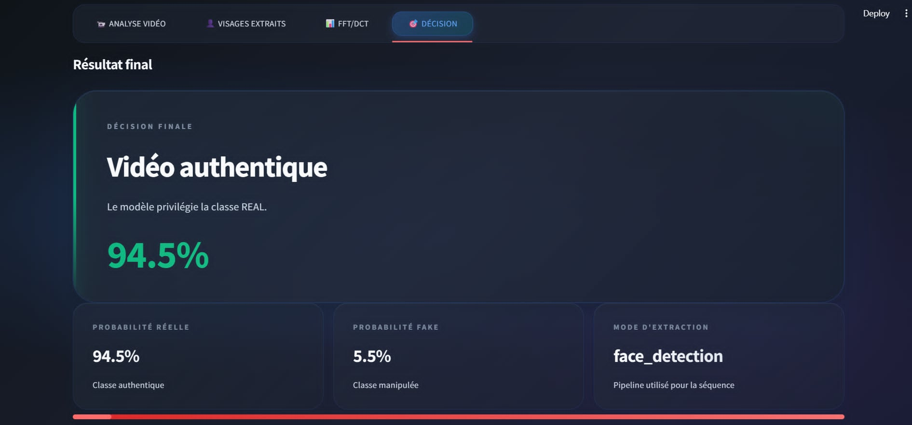
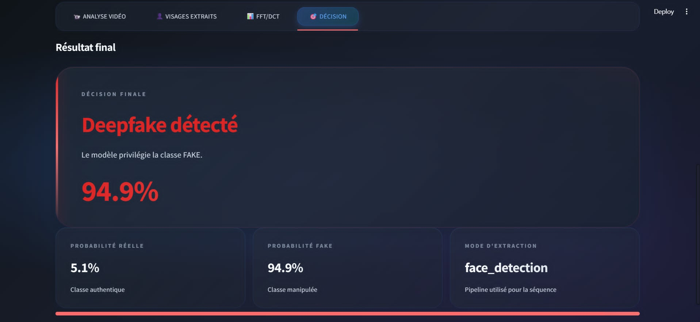

# Contexte académique

Ce projet a été réalisé dans le cadre du PCD (Projet de Conception et Développement)
de 2ème année cycle ingénieur — ENSI (École Nationale des Sciences de l'Informatique).

---

# Deepfake Detection Interface

Interface web pour détecter si une vidéo est un deepfake ou authentique.

<p align="center">
  
</p>
<p align="center">
  <em>Figure 1 — Interface principale de l'application</em>
</p>

## Caractéristiques

- Détection multimodale : combine RGB, fréquences (FFT/DCT) et signal rPPG
- Architecture avancée : CNN ResNet-18 + Transformer avec cross-attention
- Interface web : Streamlit
- Formats supportés : MP4, AVI, MOV, MKV
- Détection de visages : RetinaFace ou MTCNN

## Prérequis

- Python 3.8+
- CUDA 11.0+ (optionnel, pour GPU)
- 4 GB RAM minimum
- 2 GB espace disque

## Installation

### 1. Créer un environnement virtuel

```bash
python -m venv .venv
.venv\Scripts\activate.bat  # Windows
source .venv/bin/activate   # Linux/Mac
```

### 2. Installer les dépendances

```bash
pip install -r requirements.txt
```

Pour une installation avec support GPU NVIDIA CUDA :

```bash
pip install torch torchvision torchaudio --index-url https://download.pytorch.org/whl/cu118
pip install -r requirements.txt --no-deps
```

### 3. Placer le modèle

Le fichier `best_model_fold4.pt` doit se trouver dans le même répertoire que `app.py` :

```
interface/
├── app.py
├── best_model_fold4.pt
├── video_processor.py
├── inference.py
├── model.py
├── rppg_extractor.py
└── requirements.txt
```

## Lancement

### Option 1 : Script batch (Windows)

```bash
.\run.bat
```

### Option 2 : Ligne de commande

```bash
.venv\Scripts\activate.bat  # Windows
source .venv/bin/activate   # Linux/Mac
streamlit run app.py
```

L'interface s'ouvre sur `http://localhost:8501`.

## Utilisation

<p align="center">
  
</p>
<p align="center">
  <em>Figure 2 — Zone de chargement de la vidéo (drag & drop)</em>
</p>

1. Télécharger une vidéo via le formulaire (drag & drop ou Browse files)
2. Cliquer sur "Analyser la vidéo"
3. Attendre les résultats (30 à 60 secondes selon la vidéo)
4. Consulter le statut (DEEPFAKE ou AUTHENTIQUE), la probabilité totale et le détail des scores

### Exemples de résultats

<p align="center">
  
</p>
<p align="center">
  <em>Figure 3 — Exemple de résultat : vidéo authentique détectée à 94.5%</em>
</p>

<p align="center">
  
</p>
<p align="center">
  <em>Figure 4 — Exemple de résultat : deepfake détecté à 94.9%</em>
</p>

## Architecture du modèle

```
Input: Vidéo
    |
[Frame Extraction] -> 16 frames de 224x224 pixels
    |
Multimodal Processing :
  - CNN (EfficientNet 4B)  : (B, T, 512) -> (B, T, 256)
  - Frequency Features     : (B, T, 10)  -> (B, T, 256)
  - rPPG Signal            : (B, 6)      -> (B, 256)
    |
[Cross-Attention A] : Freq -> CNN
    |
[Temporal Encoder] : coherence temporelle (Transformer)
    |
[Cross-Attention B] : rPPG -> Temporal Features
    |
[Classifier Head] : (B, 2) -> probas [Real, Fake]
    |
Output: Real/Fake + Confidence
```

## Configuration

Dans la sidebar de l'interface :
- Chemin du modèle : spécifier le chemin vers le checkpoint
- Device : choisir CPU ou CUDA

## Structure des fichiers

```
interface/
├── app.py                # Application Streamlit
├── inference.py          # Module d'inférence
├── model.py              # Architecture du modèle
├── video_processor.py    # Traitement vidéo et détection de visages
├── rppg_extractor.py     # Extraction du signal physiologique
├── requirements.txt      # Dépendances Python
├── run.bat               # Script de lancement (Windows)
└── README.md
```

## Sources

Le code a été extrait et refactorisé à partir de :
- `pcdlastwork (1).ipynb` : extraction de frames, détection de visages, analyse de fréquences
- `notebooke5ca2fbf26.ipynb` : entraînement du modèle multimodal

## Conseils de performance

- GPU disponible : augmente la vitesse de 5 à 10x
- Durée vidéo optimale : 5 à 30 secondes
- Résolution minimale : 240p, idéalement 720p+

## Licence

Projet éducatif pour la détection de deepfakes.

---

Version : 1.0
Modèle : CNN + Transformer multimodal (5-fold CV)